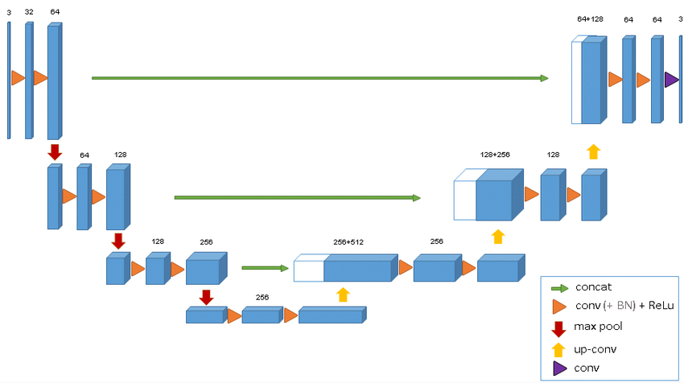
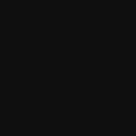
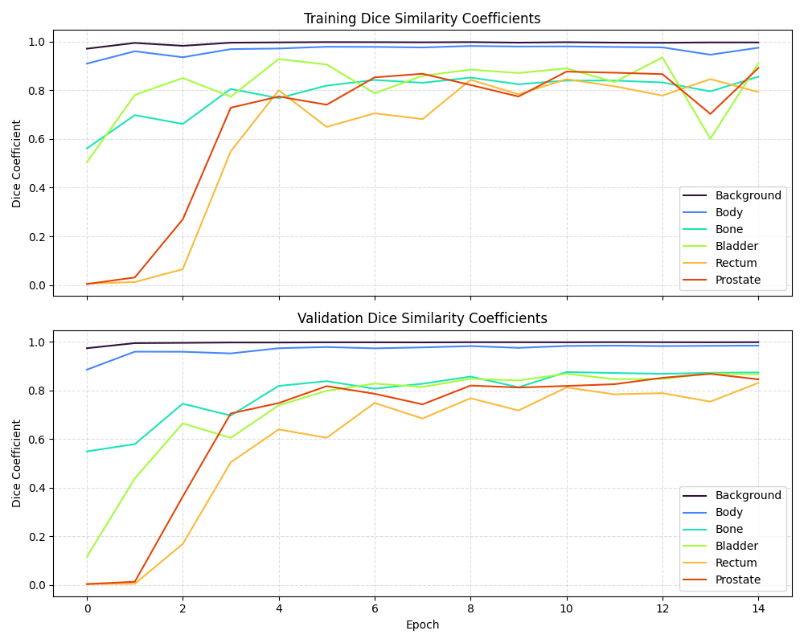
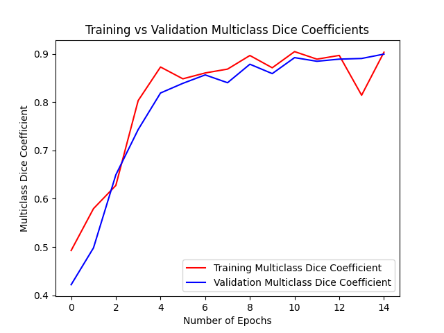

## Description

This project implements a 3D-UNet to segment a downsampled Prostate 3D data set with the goal of having a minimum dice similarity coefficient of 0.7 when testing.

## Project Folder Structure

```bash
└── 3DUNet-prostate-46410483
    ├── readme_images
    │   ├── 3DUnet_architecture.png
    │   ├── ground_truth.gif
    │   └── model.gif
    ├── .gitignore
    ├── dataset.py
    ├── modules.py
    ├── predict.py
    ├── train.py
    └── README.md

```

## Model Architecture

The model implemented is based on the 3D-UNet describes in [1] and has the following architecture:


[1]

The input into this 3D-UNet is one channel as the Prostate dataset is grayscale and the output is the number of classes in this case 6.

The proposed 3D-UNet has the following channel sizes:

    3 -> 64 -> 128 -> 256 -> 512 -> 256 -> 128 -> 64 -> 3

However to decrease the amount of VRAM needed the following channel sizes have been used for this version of the model:

    1 -> 32 -> 64 -> 128 -> 256 -> 128 -> 64 -> 32 -> 6

### Analysis Path:

This 3D-UNet consists of 4 resolution steps with each step consisting of two sub-steps which is a 3D convultion with a kernel size of 3 the result is then passed into 3D batch normalisation and then into a ReLu activation function. This same sub-step is then conducted again and the final result is passed through a 3D max pooling with a kernel size of 2 and a stride of 2.

### Synthesis Path:


## Dataset

The dataset used is a Prostate 3D data set provided by [2] it contains 211 MRI scans and ground truth labels in the NifTI file format.

For the training, validation and testing of the model a 80%/10%/10% was choosen for the size of the dataset respectively. The data is randomly selected from the main dataset when creating these datasets to allow for each model to be trained on different data.

Additionally, the data has been downsampled by a factor of 0.5 to reduce complexity and time for training, the factor can be changed in the main loop of train.py by changing downsample_factor to allow for the original image resolution to be used.

## Usage

**Dependencies**

- **Python** 3.12.5
- **pytorch** 2.8.0
- **matplotlib** 3.10.6
- **numpy** 2.1.2
- **nibabel** 5.3.2
- **imageio** 2.37.0

### Training:

To create and train a model, running the following line in the 3DUNet-prostate-46410483 directory

```bash
python train.py
```

This will create, train, validate and test a model and save the resulting model into the /model directory

### Predict:

To use a previously created model to create visualations of the preformance of the model run the following line in the 3DUNet-prostate-46410483 directory

```bash
python predict.py
```

## Results

Below are two gifs of the same image with masks overlayed on them, the left gif uses the masks produced by the model and the right gif uses the ground truth masks provided by the dataset.

| Model | Ground Truth |
| :---: | :----------: |
|  |  |

The following images are examples of what is provided at the end of training a model:





## References
