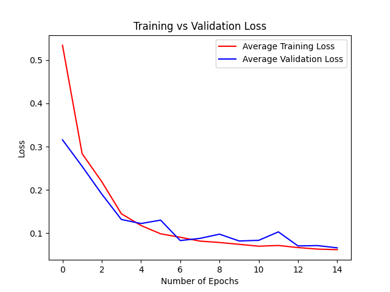
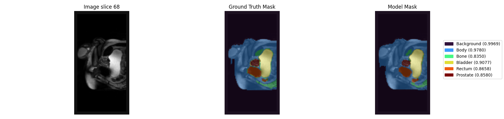

## Description

This project contains:
- A PyTorch implementation of a 3D-UNet
- Training, Validation and Testing loops for the 3D-UNet
- A custom dataset for the Prostate 3D data set

This project implements a 3D-UNet to segment a downsampled Prostate 3D data set [[2]](#references) with the goal of having a minimum dice similarity coefficient of 0.7 when testing.

The main goal of this is to reduce required time and labour costs required in labeling MRI scans, allowing doctors and patients to recieve data and results faster.

Additionally, if this model is trained well it could be able to perform a more consistent standard of segementation and labeling as it will not be effected by human-error.

## Project Folder Structure

```bash
└── 3DUNet-prostate-46410483
    ├── example_images
    │   ├── 3DUnet_architecture.png
    │   ├── example_dice_plot.png
    │   ├── example_loss_plot.png
    │   ├── example_multiclass_plot.png
    │   ├── ground_truth.gif
    │   └── model.gif
    ├── .gitignore
    ├── dataset.py
    ├── modules.py
    ├── predict.py
    ├── train.py
    └── README.md

```

## Model Architecture

The model implemented is based on the 3D-UNet describes in [[1]](#references) and has the following architecture:


Figure 1: 3D-UNet architecture (Figure 2 from [[1]](#references))

The input into this 3D-UNet is one channel as the Prostate dataset is grayscale and the output is the number of classes in this case 6.

The proposed 3D-UNet has the following channel sizes:

    3 -> 64 -> 128 -> 256 -> 512 -> 256 -> 128 -> 64 -> 3

However to decrease the amount of VRAM needed the following channel sizes have been used for this version of the model:

    1 -> 32 -> 64 -> 128 -> 256 -> 128 -> 64 -> 32 -> 6

### Analysis Path (Encoder):

This 3D-UNet consists of 4 resolution steps with each step consisting of two sub-steps which is a 3D convultion with a kernel size of 3 the result is then passed into 3D batch normalisation and then into a ReLu activation function. This same sub-step is then conducted again and the final result is passed through a 3D max pooling with a kernel size of 2 and a stride of 2.

### Synthesis Path (Decoder):

In the synthesis path upsampling will be conducted by passing the input through a transpose 3D convolution with a kernel size of 2 and a stride of 2 to upsample without changing the resolution. Then the result will be passed into the previously mentioned convulition block twice.


## Dataset

The dataset used is a Prostate 3D data set provided by [[2]](#references) it contains 211 MRI scans and ground truth labels in the NifTI file format.

For the training, validation and testing of the model a 80%/10%/10% was choosen for the size of the dataset respectively. The data is randomly selected from the main dataset when creating these datasets to allow for each model to be trained on different data.

Additionally, the data has been downsampled by a factor of 0.5 to reduce complexity and time for training, the factor can be changed at the top of train.py by changing DOWNSAMPLE_FACTOR to allow for the original image resolution to be used.

## Usage

**Dependencies**

- **Python** 3.12.5
- **pytorch** 2.8.0
- **matplotlib** 3.10.6
- **numpy** 2.1.2
- **nibabel** 5.3.2
- **imageio** 2.37.0

### Hyper Parameters:

All hyper parameters can be found at the top of train.py

| Parameter             | Default                              |
| --------------------- | ------------------------------------ |
| Learning rate (LR)    | 0.001                                |
| Number of epochs (EPOCHS) | 15 |
| Number of in channels (IN_CHANNELS) | 1 |
| Number of out channels (OUT_CHANNELS) | 6 |
| Cross entropy weight (CE_WEIGHT) | 0.5 |
| Dice loss weight (DICE_WEIGHT) | 0.5 |
| Smoothing (SMOOTHING) | 1e-6 |
| Number of Classes | 6 |

### Training:

#### Training Components:

| Component | Description |
| --------- | ----------- |
| Loss funtion | Weight dice and cross entropy loss |
| Optimizer | Adam (lr = 0.001) |


To create and train a model, running the following line in the 3DUNet-prostate-46410483 directory

```bash
python train.py
```

#### Terminal Output:

Below is a sample of the output that will provided while training:

```bash
          Epoch: 3, Steps Completed: 50/168
          Epoch: 3, Steps Completed: 100/168
          Epoch: 3, Steps Completed: 150/168

    📍 Epoch 4/15 Complete: Avg Training Loss = 0.1615, Avg Validation Loss = 0.1655
          Dice Similarity Coefficients:
             Multiclass: 0.8035
             Background: 0.9956
             Body: 0.9691
             Bone: 0.8054
             Bladder: 0.7735
             Rectum: 0.5492
             Prostate: 0.7284
```

Below is a sample of the output that will provided when training is finished:

```bash
Training complete with 3D UNet

Final average training loss: 0.0633
Final average training loss: 0.0754
Final multiclass dice similartiy coefficient: 0.9038

```

This will create, train, validate and test a model and save the resulting model into the /model directory

### Predict:

To use a previously created model to create visualations of the preformance of the model run the following line in the 3DUNet-prostate-46410483 directory

```bash
python predict.py
```

#### Terminal Output:

Below is a sample of the terminal output that will provided:

```bash
Starting Testing 3D UNet

       Steps Completed: 1/22
       Steps Completed: 2/22
       Steps Completed: 3/22
       Steps Completed: 4/22
       Steps Completed: 5/22
       Steps Completed: 6/22
       ...

Average loss while testing: 0.0744 
```

## Results

To consistantly get above 0.7 dice similarity coefficients for all classes 15 epochs is recommended by 10 epochs will give an above 0.7 dice similarity coefficients for all classes most of the time.

### Example Output

The following results is what will be provided when using train.py and predict.py, this example model was trained with 15 epochs

#### Final Results

Final average training loss: 0.0620
Final average validation loss: 0.0661

| Class      | Dice Similarity Coefficients |
| ---------- | ---------------------------- |
| Multiclass | 0.9188                       |
| Background | 0.9984                       |
| Body       | 0.8796                       |
| Bladder    | 0.9577                       |
| Rectum     | 0.8020                       |
| Prostate   | 0.8910                       |

Average loss after testing: 0.0696

#### Training output

The following images are examples of what is provided at the end of training a model:

The following plot shows that the average losses for training and validation converge around 0.1. This also shows that the model is not overfitting to the training dataset.



The following plot shows that dice similarity coefficients for each class increase each epoch for both the training and validation of the model, converging above 0.7 after training is complete.


The following plot shows the multiclass dice similarity coefficients for both training and validation increase throughout the training of the model, converging just under 0.9.


#### Predict Output

The following image is an example of the outputted plot when testing has concluded:



Below are two gifs of the same image with masks overlayed on them, the left gif uses the masks produced by the model and the right gif uses the ground truth masks provided by the dataset.

| Model | Ground Truth |
| :---: | :----------: |
|  |  |

## References

[1] Ö. Çiçek, A. Abdulkadir, S. S. Lienkamp, T. Brox, and O. Ronneberger, “3D U-Net: Learning Dense Volumetric Segmentation from Sparse Annotation,” arXiv:1606.06650 [cs], Jun. 2016, Available: https://arxiv.org/abs/1606.06650

[2] “CSIRO Data Access Portal,” Csiro.au, 2025. https://data.csiro.au/collection/csiro:51392v2?redirected=true